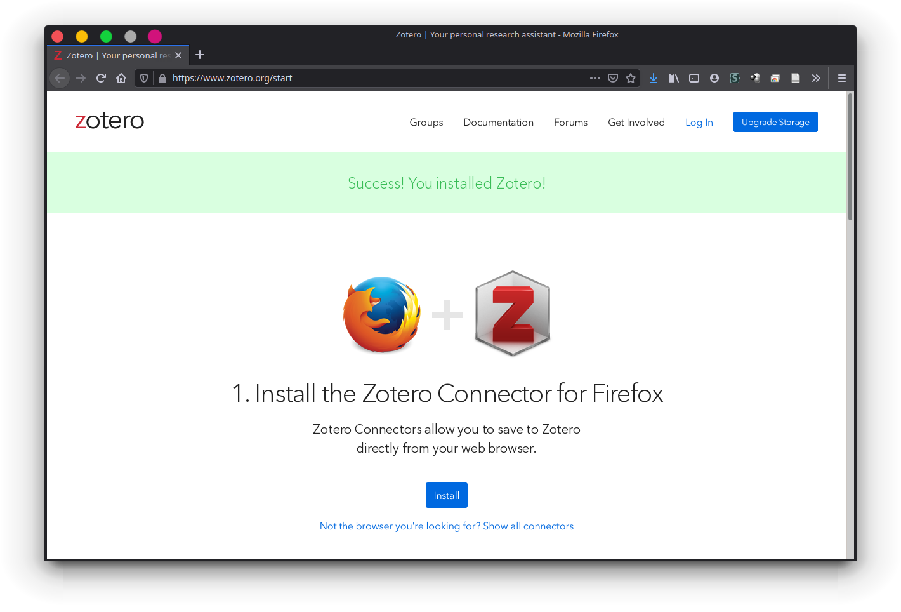
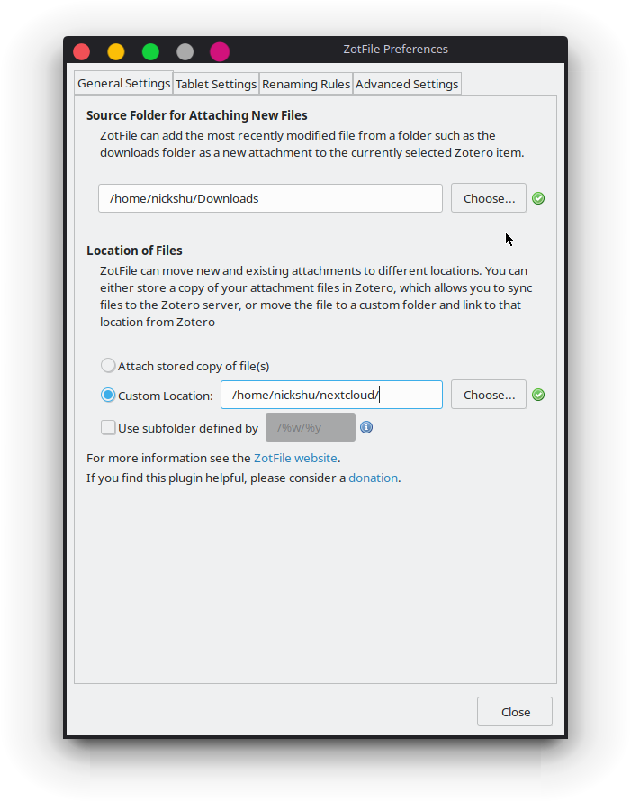

# Why?

We all know that for literature review, we all have to manage multiple papers, and sometimes it can turn very cumbersome to keep track of all of them. A reference management software is very helpful for such tasks! Prior to this, I used [Mendeley](https://www.mendeley.com/) which works well and all, but there are a lot of strings attached with it. It is a closed source software, and it was purchased by Elsevier, which, in my opinion is a really corrupt company. Plus, at the time that I stopped using Mendeley, storage plans were only possible via their servers. This meant that you could have at most 2GB of free storage, and you'd have to pay $55/year for 5GB, $110/year for 10GB, or $165/year for unlimited storage. I really dislike Elsevier and I didn't want to pay for such low amount of storage. I mean, Google Drive offers $30/year for 200GB. Elsevier always tries to get money from people for their lowest amount of efforts. So, I switched to Zotero. Initially, it was a little hard, but I then got used to it. So here's a guide to get a full working Zotero platform, as well as setting it up for back ups. 


# Installation & Setup

## Install Zotero Standalone

On Linux, I have found over the years that the easiest way to get it installed in Linux is via a Snap Package. If you are using a Debian system, it's helpful to have `snapd` already installed. 

```bash
sudo apt update
sudo apt install snapd
```

Then install it via 

```bash
sudo snap install zotero-snap
```

## Install a Cloud Syncing Service (Optional)

I suggest installing a cloud service that you may enjoy. Some may like [Dropbox](https://www.dropbox.com/), [Google Drive](https://www.google.com/intl/en_gh/drive/download/), [Box](https://www.box.com/), [MEGA](https://mega.nz), or any other. I have my own server running [NextCloud](https://nextcloud.com/), so I use that instead, but if you wish to use any of the previous ones, I am a huge fan of MEGA. I used to use Dropbox for the most part, but MEGA provides you with 50GB of free storage, so it becomes really easy to store lots of files. Whichever one, as long as you possess a destination folder in your system to use it, it's all good! =]

## Setup Zotero

Once you have it installed, it should open, along with a Zotero Connector for your browser. I highly suggest to use the Zotero Connector



On Zotero Preferences, I honestly prefer not to set anything on the `Sync` tab so that there's no confusion (for me) of where the files will go. I would, however, make note of where the data directory is located in the `Advanced` tab, because we will need this later. 

Next install [Zotfile](zotfile.com) by simply going to their website and downloading their latest `zotfile-*.xpi`. Make sure to downloaded anywhere in your system (Firefox may prompt it to install it as an add-on).  Next, on Zotero, go to `Tools > Addons` and install Zotfile from file by clicking on the gear icon, and clicking on `Install Add-on From File...`. Find your file, and then restart Zotero.


## Setup Zotfile

Now, let's configure ZotFile. By going to `Tools > ZotFile Preferences`, go to the `General Settings` tab, and doing the following: 

- Source Folder - This allows Zotero, given that you've highlighted an item in Zotero, to add an attachment to that item. [[source](https://forums.zotero.org/discussion/74208/zotfile-not-scanning-folder-for-new-files)]. This can be anything of your interest. People usually use their Downloads folder.
- Location of Files - This is where, ideally, if you installed a cloud syncing integration with your system, Zotero will place its files there. Here, if you choose to use a subfolder, depending by how you've set up the wildcards, it will place them in subfolders. For example, `/%w/%y` will separate by the Journal/Publisher  and Year. Note that the moving of the files will not work well if you have already opened the PDF file. You should be in the page of the article itself.



You can then change the Renaming Rules to however you want. [ZotFile's documentations](http://zotfile.com/#renaming-rules) provide a much better explanation on the wildcards for this. Go check it out! =]


## Install Plugins

There are a lot of other [plugins](https://www.zotero.org/support/plugins) that you may wish to use. At the time of writing this post, I haven't really explored most of them because I don't particularly need much more than this. 


## Backup and Restore

### Backing Up Library

Cool! Now, here's where things took me a while to wrap my head around. Let's go back to the preferences by going to `Edit > Preferences`. If you go to the `Advanced` tab, you'll see the Data Directory Location. 


This directory is where your personal library information will be stored. To my understanding, the most important part is the `zotero.sqlite` file. In a Windows system, you will probably need to focus on `zotero.sqlite` file and the `storage/` directory. Make sure to back them up!

For me, what I personally do is that I create hard links to my cloud syncing folder to these file(s) by writing

```bash
ln {zotero_data_directory} {path_to_cloud_folder}/zotero_backup
# or 
ln {zotero_data_directory}/zotero.sqlite {path_to_cloud_folder}/zotero_sqlite
```

### Restoring Library

Now, next time that you install Zotero again, go through all the steps above, and then, go to the data directory, and paste the {storage/, zotero.sqlite} or {zotero.sqlite} files from the backup folder on the new Zotero data directory. You may wish to save the about-to-be-replaced files on a temporary folder, but in the end of the day, you'll want to replace them with your back up files to completely restore your library. 


# Annotating PDF

There are multiple ways that you can annotate your files. Mendeley has a built-in PDF annotator, but when I used it, I felt limited by the lack of features it had. I kind of find Zotero convenient that it allows me to make annotations with my chosen PDF annotators and that's it. 

In Windows, my favorite PDF annotator of all time has to be [Drawboard PDF](https://www.drawboard.com/pdf/). To this day, I still haven't found anything that works better than it. In Linux, there's an application called [Xournal++](https://xournalpp.github.io/) (aka Xournalpp, based on Xournal, but coded in C++), which gives you lots of different types of annotation features. It just can't annotate your PDF in place, but with Zotero, you can add an annotated version of your paper as an attachment to your library. 

# Other Resources

A lot of what I got it working came from 

- [Stephen Chignell's Post on Configuring Zotero](https://www.nrel.colostate.edu/set-up-best-reference-manager/)
- [Eastern Kentucky University's Library Guide on Backing Up Zotero](https://libguides.eku.edu/c.php?g=342&p=68290)