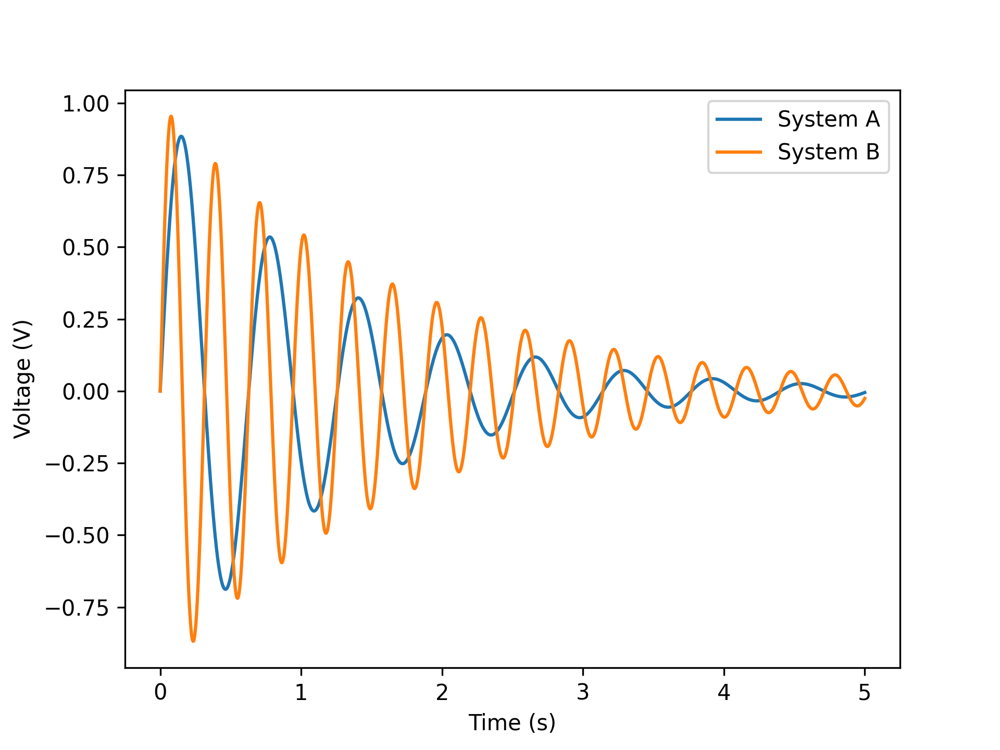
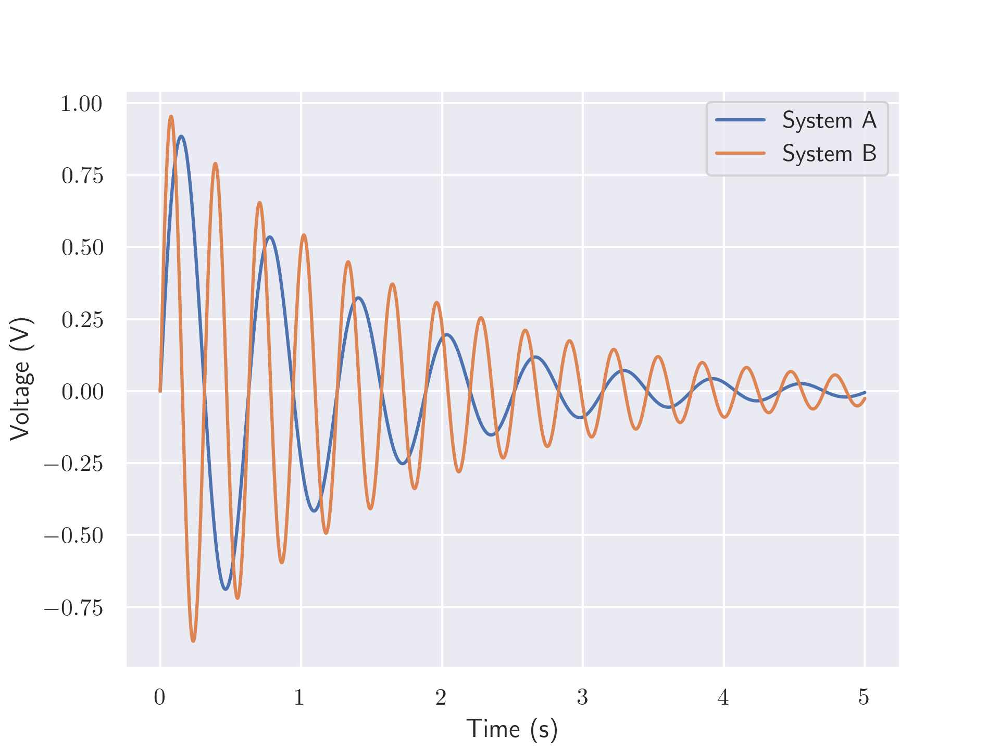
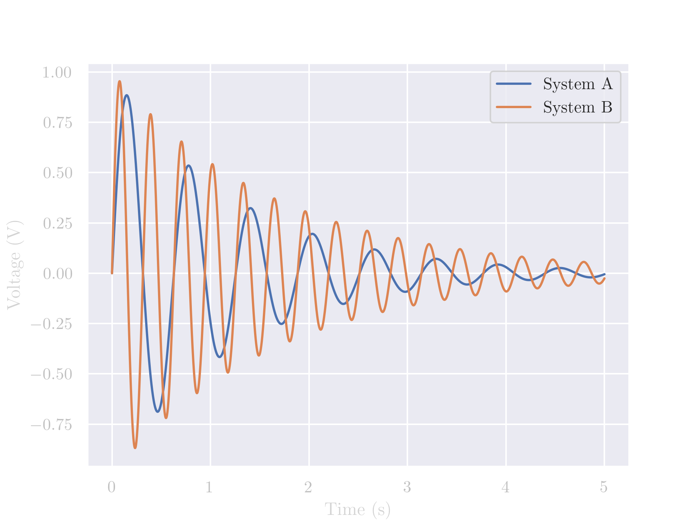
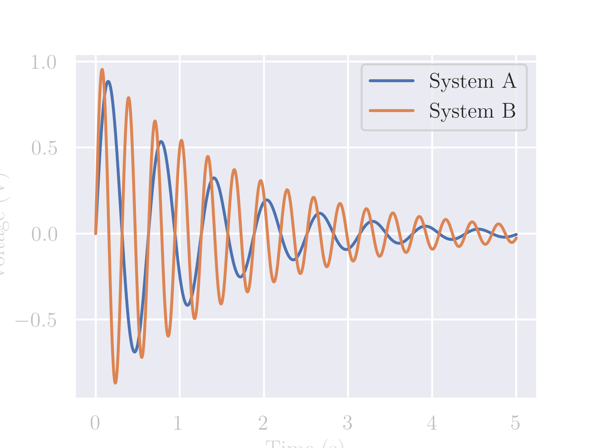
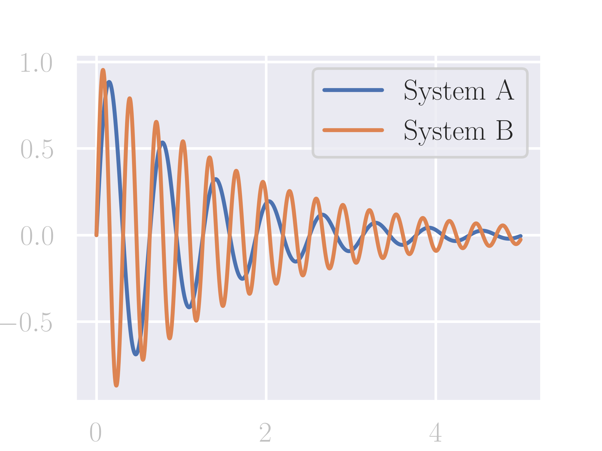
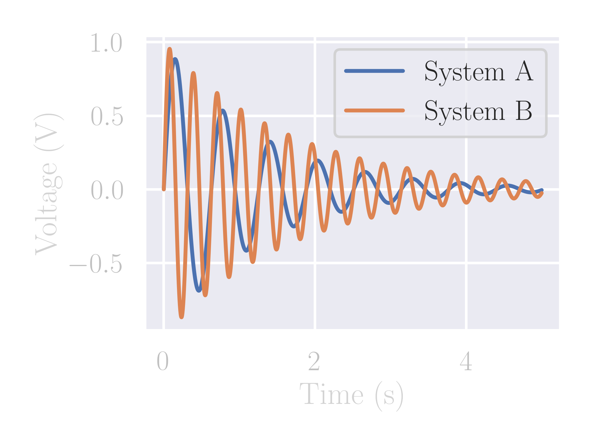

# Matplotlib

Here we will walk through a few things that you can do to change the aesthetics of your plots in Matplotlib. 

## Prep
Let us first import our libraries: 

```python
import numpy as np
import matplotlib.pyplot as plt 
```

Next we will create our data:

```python
t = np.linspace(0,5,2000)
x = np.exp(-0.8*t)*np.sin(10*t)
y = np.exp(-0.6*t)*np.sin(20*t)
```

## Base Plot

If one does a simple plot, it will look something like this:

```python
fig, ax = plt.subplots(dpi=300)
ax.plot(t,x, label="System A")
ax.plot(t,y, label="System B")
ax.set_xlabel("Time (s)")
ax.set_ylabel("Voltage (V)")
ax.legend()
fig.savefig("step1.png")
```



## Changing the Text

Text can always be improved, usually by changing the fonts. In order to do so, update the `rcParams`. For these, you should change the following parameters:
- `text.usetex`: in order to use LaTeX
- `font.family`: in order to use the Serif family
- `font.serif`: to determine the type of serif you wish to use

```python
import matplotlib as mpl 

nice_fonts = {
    "text.usetex": True,
    "font.family": "serif",
    "font.serif" : "Times New Roman",
}
mpl.rcParams.update(nice_fonts)

# ======== Same as before =========
if True:
    fig, ax = plt.subplots(dpi=300)
    ax.plot(t,x, label="System A")
    ax.plot(t,y, label="System B")
    ax.set_xlabel("Time (s)")
    ax.set_ylabel("Voltage (V)")
    ax.legend()
    fig.savefig("step2.png")
```


## Applying the Seaborn Theme

```python
import seaborn as sns
sns.set_theme()
```




## Changing the Tick Colors and Transparent Background

In order to change the color of the axes and of the ticks, you should change the `rcParams` by modifying the following parameters:
- `axes.labelcolor`
- `ytick.color`
- `xtick.color`

Additionally, this is a good point to make the background transparent. Usually, you can simply save the figure with `fig.savefig` and pass in the parameter `transparent=True`. However, that doesn't work for figures that have been themed like with Seaborn. For those, usually, there are patches that make up the background. In such case, you need to pass in the parameter `facecolor="none"`. 

```python
sns.set_theme()
nice_fonts = {
    "text.usetex": True,
    "font.family": "serif",
    "font.serif" : "Times New Roman",
    "axes.labelcolor": "lightgray",         # NEW
    "ytick.color" : "silver",               # NEW
    "xtick.color" : "silver",               # NEW
}
mpl.rcParams.update(nice_fonts)
fig, ax = plt.subplots(dpi=300)
ax.plot(t,x, label="System A")
ax.plot(t,y, label="System B")
ax.set_xlabel("Time (s)")
ax.set_ylabel("Voltage (V)")
ax.legend()
fig.savefig("step4.png",facecolor="none")   # NEW
```




## Contexts

You can also set contexts for your figures. Here we show the examples for "talk" and for "paper". In this case, this uses the command 

```python
sns.set_context("paper")
```


Whereas this uses 

```python
sns.set_context("talk")
```



It is clear that the one for "talk" has higher font sizes, but it ends up being cropped. To best set this up, you can use the command `fig.tight_layout()` to properly center the figure and the labels so that they are not cropped:

```python
sns.set_theme()
sns.set_context("talk")             # NEW
nice_fonts = {
    "text.usetex": True,
    "font.family": "serif",
    "font.serif" : "Times New Roman",
    "axes.labelcolor": "lightgray",
    "ytick.color" : "silver",
    "xtick.color" : "silver",
}
mpl.rcParams.update(nice_fonts)
fig, ax = plt.subplots(dpi=300)
ax.plot(t,x, label="System A")
ax.plot(t,y, label="System B")
ax.set_xlabel("Time (s)")
ax.set_ylabel("Voltage (V)")
ax.legend()
fig.tight_layout()                  # NEW
fig.savefig("step6b.png",facecolor="none")

```


The same goes for the context of "poster":

```python
sns.set_theme()
sns.set_context("poster")
nice_fonts = {
    "text.usetex": True,
    "font.family": "serif",
    "font.serif" : "Times New Roman",
    "axes.labelcolor": "lightgray",
    "ytick.color" : "silver",
    "xtick.color" : "silver",
}
mpl.rcParams.update(nice_fonts)
fig, ax = plt.subplots(dpi=300)
ax.plot(t,x, label="System A")
ax.plot(t,y, label="System B")
ax.set_xlabel("Time (s)")
ax.set_ylabel("Voltage (V)")
ax.legend()
# fig.tight_layout()
fig.savefig("step7.png",facecolor="none")
```



```python
sns.set_theme()
sns.set_context("poster")
nice_fonts = {
    "text.usetex": True,
    "font.family": "serif",
    "font.serif" : "Times New Roman",
    "axes.labelcolor": "lightgray",
    "ytick.color" : "silver",
    "xtick.color" : "silver",
}
mpl.rcParams.update(nice_fonts)
fig, ax = plt.subplots(dpi=300)
ax.plot(t,x, label="System A")
ax.plot(t,y, label="System B")
ax.set_xlabel("Time (s)")
ax.set_ylabel("Voltage (V)")
ax.legend()
fig.tight_layout()                  # WITH TIGHT LAYOUT
fig.savefig("step7b.png",facecolor="none")
```



# Plotly

TODO