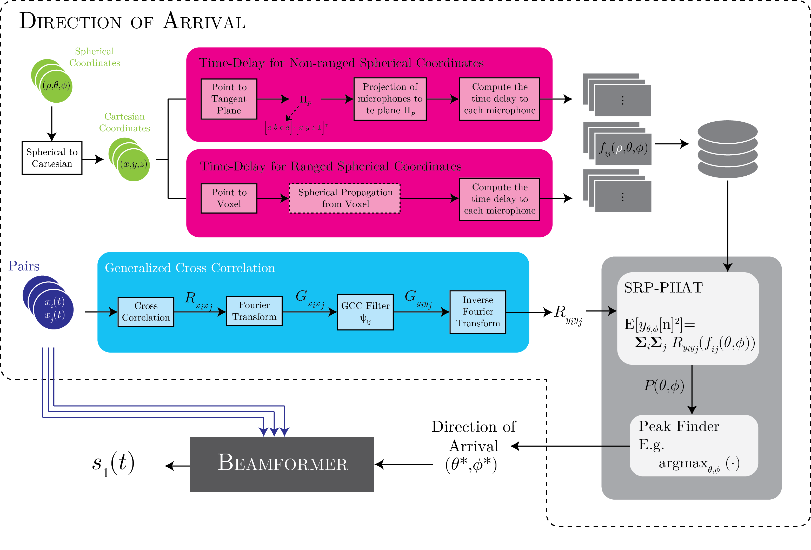
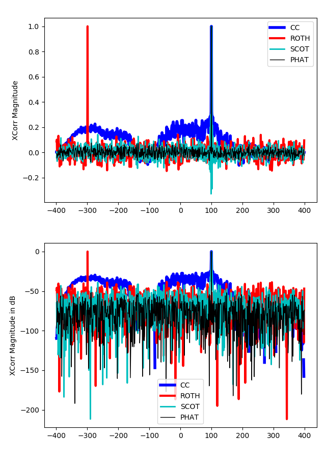

# Generalized Cross-Correlation Methods

We can set two receiving signals on two microphones as 

$$
\begin{align*}
    x_1 (t) &= s_1(t) + n_1(t) \\ 
    x_2 (t) &= \alpha s_1 (t+D) + n_2(t)
\end{align*}
$$

where $s_1(t)$ is the source signal, and $n_1(t)$ and $n_2(t)$ are the noises acquired at each of the microphones. It's important to note that the two noises are uncorrelated:

$$\mathbb{E}[n_1(t) n_2(t)]  = \mathbb{E}[n_1(t)] \cdot \mathbb{E}[n_2(t)]$$

So, if we estimate the delay $D$, we can determine the time-delay of arrival (TDOA), which can then be used to determine the direction of arrival (DOA). 

$$
\begin{align*}
    R_{x_1x_2}(\tau) &= \mathbb{E} [x_1(t) x_2(t-\tau)] \\
    &= \mathbb{E} [[s_1(t)+n_1(t)][\alpha s_1(t-\tau + D) + n_2(t)]] \\
    &= \alpha \mathbb{E} [s_1(t) s_1(t-\tau + D)] \\
    &= \alpha R_{s_1 s_1}(D-\tau)
\end{align*}
$$

An autocorrelation always has a max at $\tau = 0$. Thus $R_{x_1 x_2} (\tau)$ will have a peak at $\tau = D$ (where $D-\tau = 0$). The definition of the \textbf{cross power spectrum} $G_{x_1 x_2}(f)$ is 

$$
\begin{align*}
    G_{x_1 x_2}(f) &= \mathcal{FT} \{R_{x_1 x_2}(\tau) \} \\
    &= \alpha \underbrace{G_{s_1 s_1}(f)}_{\substack{\text{Auto Power} \\ \text{Spectrum of $s_1$}}} \cdot e^{-j 2\pi f D}
\end{align*}
$$

The autocorrelation of white noise is a delta function. If there were reverberations, then the autocorrelation $R_{x_1 x_2}(\tau)$ will have multiple peaks. Now we can form a basis for generalized cross correlation weighing methods. 

$$
\begin{align*}
    y_1(t) = h_1(t) * x_1(t) \\
    y_2(t) = h_2(t) * x_2(t) \\
\end{align*}
$$

So we can set a combined filter as 

$$
\begin{align*}
    G_{y_1 y_2}(f) &= H_1(f) H_2^*(f) G_{x_1 x_2}(f) \\
    R_{y_1 y_2}(f) &= \int_{-\infty}^{\infty} \overbrace{H_1(f) H_2^*(f)}^{\psi(f)} G_{x_1 x_2}(f) e^{j 2\pi f \tau} \\
    &= \int_{-\infty}^{\infty} \psi(f) G_{x_1 x_2}(f) e^{j 2\pi f \tau} \\
    \hat{R}_{y_1 y_2}(f) &= \int_{-\infty}^{\infty} \psi(f) \hat{G}_{x_1 x_2}(f) e^{j 2\pi f \tau}
\end{align*}
$$

where $(^*)$ indicates the Hermitian, and since we can never obtain the true $G_{\cdot}$, we obtain an observed $\hat{G}_\cdot$. 

And then, the goal is to try to find the best $\psi(f)$, which attenuates the frequencies in the noise spectra. For such, three different methods:

- ROTH 
- Smoothed Coherence Transform (SCOT)
- Phase Transform (PHAT)

# ROTH

For this, we define 
$$\psi (f) = \frac{1}{G_{x_1 x_1}(f)}$$

$$R_{y_1 y_2}(\tau) = \int_{-\infty}^\infty \frac{G_{x_1x_2}(f)}{G_{x_1x_1}} e^{j 2 \pi f \tau} df$$ 

So we substitute $G_{x_1 x_2}(f)$ assuming that the noise is uncorrelated. So we obtain 

$$
\begin{align*}
\hat{R}_{y_1 y_2}(\tau) &= \int_{-\infty}^{\infty} \frac{\alpha \hat{G}_{s_1 s_1}(f)}{G_{x_1 x_1}(f)} e^{j 2 \pi f (\tau - D)} df \\
&= \delta (\tau - D) * \int_{-\infty}^{\infty} \frac{\alpha \hat{G}_{s_1s_1} (f) }{G_{s_1s_1}(f) + G_{n_1 n_1}(f)} e^{j2\pi f \tau} df
\end{align*}
$$

Now, the $\delta(t)$ will be spread being dependent on the values of $G_{n_1n_1}(f)$. For frequencies where $G_{n_1n_1}(f)$ have a high magnitude, the cross-correlation will be supressed. In other words, where there are peaks in the frequencies where the noise $n_1(t)$ is high, they'll disappear. But this does not help to improve there there are high noise $n_2(t)$ regions. 

# SCOT
Here, we try to solve the previous issues by implementing the following filter

$$\psi (f) = \frac{1}{\sqrt{G_{x_1x_1}(f) G_{x_2x_2}(f)}}$$

And this takes care of the regions where either $n_1(t)$ or $n_2(t)$ are high. 

# PHAT

But, the issue is that $R_{y_1y_2}(\tau)$ is spread around $\delta(t)$ depending on the cross spectrum $G_{x_1x_2}(f)$. The nice thing is that the TDOA information is carried only by the phase of the cross-spectrum and not the amplitude. Therefore, we can set the following filter 

$$\psi(f) = \frac{1}{|G_{x_1x_2}(f)|}$$

As we previously saw, 

$$
\begin{align*}
G_{x_1x_2}(f) &= \alpha G_{s_1s_1}(f) e^{-j2\pi f D}\\
|G_{x_1x_2}(f)| &= \alpha G_{s_1s_1}(f)
\end{align*}
$$

Thus by combining them, 
$$ \frac{G_{x_1x_2}(f)}{|G_{x_1x_2}(f)|} = \frac{\alpha G_{s_1s_1}(f) e^{-j2\pi f D}}{\alpha G_{s_1s_1}(f)} = e^{-j2\pi f D}$$

Therefore, 

$$
\begin{align*}
    R_{y_1y_2} &= \int_{-\infty}^{\infty} e^{j 2\pi f (\tau-D)} df \\
    &= \delta(\tau - D) * \int_{-\infty}^{\infty} e^{j2\pi f \tau} df 
\end{align*}
$$

It is important to note a few assumptions: 

- $n_1$ and $n_2$ are uncorrelated
- $G_{x_1x_2}(f)$ is unknown, but we only have $\hat{G}_{x_1x_2}(f) (\neq G_{x_1x_2}(f))$, which yields it not being a $\delta(t)$. When $G_{s_1s_1}(f)$ is low, then the error is magnified, thus potentially can make PHAT produce poor results. 

Steered Response Power (SRP) is different from TDOA! 

- GCC are usually simple cross correlations between each pair of microphones, and then it estimates the time-delay 
- SRP, however, looks at all directions individually and computes the power of the signal cross correlation in that direction. The assumtion si that the cross power of steered microphone signal is maximal at the source position. But because of high dimensionality, this may be hard to do for real-time applications

# Steered Response Power
This is based on the delay-sum for a location at a range $\rho$, an azimuth angle $\theta$, and a pitch angle $\phi$. The output of the beamformer is 

$$
\begin{align*}
    y_{\rho \theta \phi}[n] &= \sum_{m=0}^{M-1} w_m x_m [n + f_{0,m}(\rho,\theta, \phi)] \\
    x_0[n] &= \text{ signal received at the time $n$, at an arbitrary microphone used as reference} \\
    w_m &= \text{amplitude weight for the $m^{th}$ microphone} \\
    f_{0,m}(\rho, \theta, \phi) &= \text{relative delay between reference microphone and $m^{th}$ microphone}
\end{align*}
$$

When the far-field approximation is assumed, the range cannot be computed. Therefore, it becomes 

$$y_{\theta, \phi}[n] = \sum_{m=0}^{M-1} w_m x_m [n + f_{0,m}(\theta, \phi)]$$

When $w_m = 1$, which means that we assuem that the microphones are perfectly omnidirectional and equally sensitive, the oputput power of the beamformer becomes 

$$\mathbb{E}[y_{\theta, \phi}[n]^2] = \sum_{i=0}^{M-1} \sum_{j=0}^{M-1} R_{x_ix_j} [f_{i,j} (\theta, \phi)] \text{ for } i\neq j$$

So, this all basically means: 

- Compute the cross correlation of signals received for all microphone pairs
- Compute, for each angle ($\theta, \phi$) in the search map, the corresponding set of delays for every microphone pair $f_{i,j}(\theta, \phi)$ 
- For each $(\theta,\phi)$ pair, sum the cross correlation values at the corresponding delays from all microphone pairs. The sum is the output of the SRP beamformer

$$S_{SRP}(\theta,\phi) = \mathbb{E}[y_{\theta, \phi}^2[n]]$$

# SRP-PHAT

Therefore, we can combine PHAT with SRP in order to make the SRP-PHAT algorithm, by pre-filtering the cross-correlations prior to the SRP step

$$
\begin{align*}
    R_{x_ix_j}(\tau) &= \sum_{k=0}^{N_f - 1} \psi_{ij}(k) X_i (k) X_j^* (k) e^{j 2\pi \frac{k}{N_f} \tau} \\
    \psi_{ij} (k) &= \frac{1}{|X_i(k) X_j^*(k)|}
\end{align*}
$$

In order to obtain the $f_{ij}(\theta,\phi)$, which is dependent on the array configuration. 

$$(\rho,\theta, \phi) \longrightarrow \text{Tangent Plane to Sphere}$$

$$\overrightarrow{m}_k \rightarrow \text{Projection to the plane} \rightarrow \text{Distance from }\overrightarrow{m}_k\text{ to projection}$$

# Comparison

